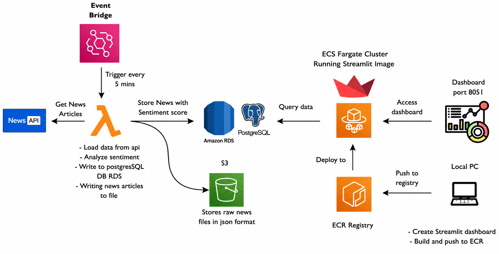

# 📰 AWS News Sentiment Analysis Pipeline

## 📌 Project Overview

This project is an end-to-end cloud-based **News Sentiment Analysis Pipeline** built using AWS services, Python, Docker, PostgreSQL, and Streamlit.

The pipeline automatically fetches live news articles from the News API, performs sentiment analysis, stores both raw and processed data in AWS cloud services, and displays analytics in a real-time interactive dashboard.

---

# 🚀 Architecture Diagram


---

# ⚙️ Technologies Used

## 🐍 Programming & Frameworks

* Python
* Streamlit
* SQLAlchemy
* Pandas
* Plotly

---

## ☁️ AWS Services

* AWS Lambda
* Amazon EventBridge
* Amazon S3
* Amazon RDS PostgreSQL
* Amazon ECR
* Amazon ECS Fargate
* Amazon CloudWatch

---

## 🐳 DevOps & Deployment

* Docker
* GitHub
* Amazon ECR
* ECS Fargate

---

# 📊 Features

✅ Automated News Ingestion

✅ Real-Time Sentiment Analysis

✅ AWS Lambda Serverless Processing

✅ EventBridge Scheduling Automation

✅ Raw JSON Storage in Amazon S3

✅ Processed Data Storage in PostgreSQL RDS

✅ Interactive Streamlit Dashboard

✅ Pie Charts & Bar Graph Analytics

✅ Dockerized Deployment

✅ ECS Fargate Hosting

✅ CloudWatch Monitoring

---

# 🔄 End-to-End Pipeline Flow

```text
News API
   ↓
AWS EventBridge
   ↓
AWS Lambda
   ↓
Sentiment Analysis
   ↓
Amazon S3 + PostgreSQL RDS
   ↓
Docker Container
   ↓
Amazon ECR
   ↓
Amazon ECS Fargate
   ↓
Streamlit Dashboard
```

---

# 📂 Project Structure

```text
news_project/
│
├── modules/
│   ├── __pycache__/
│   ├── database.py
│   ├── display.py
│   ├── fetch_news.py
│   ├── save_files.py
│   └── sentiment_analysis.py
│
├── data/
│
├── db/
│
├── LAMBDA_PROJECT/
│   │
│   ├── modules/
│   │   ├── config.py
│   │   ├── database.py
│   │   ├── fetch_news.py
│   │   ├── s3_storage.py
│   │   └── sentiment_analysis.py
│   │
│   ├── lambda_function.py
│   ├── requirements.txt
│   └── lambda.zip
│
├── .dockerignore
├── .env
├── .gitignore
├── app.py
├── Architecture.png
├── config.py
├── Dockerfile
├── main.py
├── README.md
├── requirements.txt
└── streamlit_app.py

---

# 📈 Dashboard Features

* 📊 Sentiment Metrics Cards
* 🥧 Pie Chart Visualization
* 📉 Bar Chart Analytics
* 📄 Raw News Data Viewer
* 🎯 Sentiment Filtering
* 🔄 Auto Refresh Capability
* 🎨 Color Highlighted Sentiment Table

---

# 🛠️ Setup Instructions

## 1️⃣ Clone Repository

```bash
git clone <YOUR_GITHUB_REPO_URL>
cd news_project
```

---

## 2️⃣ Install Dependencies

```bash
pip install -r requirements.txt
```

---

## 3️⃣ Run Streamlit Dashboard

```bash
streamlit run streamlit_app.py
```

---

# 🐳 Docker Commands

## Build Docker Image

```bash
docker build -t news-dashboard .
```

## Run Docker Container

```bash
docker run -p 8501:8501 news-dashboard
```

---

# ☁️ AWS Deployment

## AWS Services Integrated

* Lambda for serverless ETL
* EventBridge for scheduling automation
* S3 for raw JSON storage
* RDS PostgreSQL for processed data
* ECR for container image storage
* ECS Fargate for dashboard hosting
* CloudWatch for monitoring and logs

---


# ⭐ Project Status

✅ Completed End-to-End AWS Cloud Data Pipeline

✅ Production-Style Modular Architecture

✅ Automated & Event-Driven Workflow
